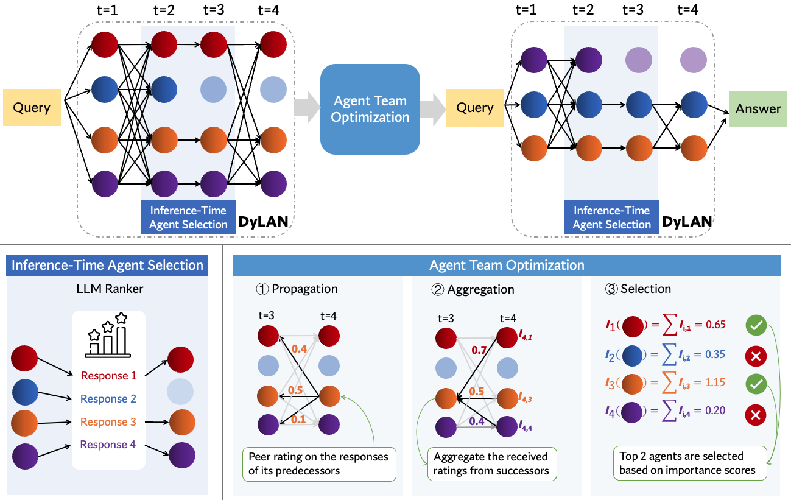

# DyLAN

Official Implementation of [**Dynamic LLM-Agent Network: An LLM-agent Collaboration Framework with Agent Evaluation**](https://arxiv.org/abs/2310.02170)

Authors: [Zijun Liu](https://www.semanticscholar.org/author/Zijun-Liu/2117942065), [Yanzhe Zhang](https://stevenyzzhang.github.io/website/), [Peng Li](http://www.lpeng.net/), [Yang Liu](http://nlp.csai.tsinghua.edu.cn/~ly/), [Diyi Yang](https://cs.stanford.edu/~diyiy/)

```
@misc{liu2023dynamic,
    title={Dynamic LLM-Agent Network: An LLM-agent Collaboration Framework with Agent Team Optimization},
    author={Zijun Liu and Yanzhe Zhang and Peng Li and Yang Liu and Diyi Yang},
    year={2023},
    eprint={2310.02170},
    archivePrefix={arXiv},
    primaryClass={cs.CL}
}
```

## Overview



<details><summary>Abstract</summary>

Large language model (LLM) agents have been shown effective on a wide range of tasks, and by ensembling multiple LLM agents, their performances could be further improved. Existing approaches employ a fixed set of agents to interact with each other in a static architecture, which limits their generalizability to various tasks and requires strong human prior in designing these agents.

In this work, we propose to construct a strategic team of agents communicating in a dynamic interaction architecture based on the task query. Specifically, we build a framework named Dynamic LLM-Agent Network (**DyLAN**) for LLM-agent collaboration on complicated tasks like reasoning and code generation. DyLAN enables agents to interact for multiple rounds in a dynamic architecture with inference-time agent selection and an early-stopping mechanism to improve performance and efficiency.

We further design an automatic agent team optimization algorithm based on an unsupervised metric termed *Agent Importance Score*, enabling the selection of best agents based on the contribution each agent makes. Empirically, we demonstrate that DyLAN performs well in both reasoning and code generation tasks with reasonable computational cost. DyLAN achieves 13.0\% and 13.3\% improvement on MATH and HumanEval, respectively, compared to a single execution on GPT-35-turbo. On specific subjects of MMLU, agent team optimization in DyLAN increases accuracy by up to 25.0\%.

</details>

We provide the code and experiment records of our paper. The code is in `code` folder, and the experiment records are in `exp` folder. We also provide a demo for arbitrary queries.

## Structure of the folder

- `code`: Code of DyLAN.
  - `demo`: Demo of DyLAN.
  - `MATH`: Code of DyLAN on MATH dataset.
  - `MMLU`: Code of DyLAN on MMLU dataset.
  - `HumanEval`: Code of DyLAN on HumanEval dataset.
- `exp`: Experiment records of DyLAN.
  - `MATH`: Experiment records of DyLAN on MATH dataset.
  - `MMLU`: Experiment records of DyLAN on MMLU dataset.
    - `mmlu_optimal7_$N$`: Experiment records of DyLAN on MMLU dataset of Figure 3 in the paper. $N$ denotes the number of agents.
  - `HumanEval`: Experiment records of DyLAN on HumanEval dataset.

One can easily verify the results by running the command as follows after installing the requirements:

```bash
python code/MATH/eval_math.py exp/MATH/CoT None
python code/MATH/eval_math.py exp/MATH/Complex None
python code/MMLU/eval_mmlu.py exp/MMLU/mmlu_optimal7_7 None
python code/MMLU/eval_mmlu.py exp/MMLU/mmlu_optimal7_3 None
python code/MMLU/eval_mmlu.py exp/MMLU/mmlu_optimal7_4 None
python code/MMLU/eval_mmlu.py exp/MMLU/mmlu_optimal7_2 None
```

## Installation

```bash
cd code
pip install -r requirements.txt
```

## Usage

### Demo / Quick Start

1. Put your query in `code/demo/run_DyLAN.py` like:

    ```python
    QUERY = "What is the sum of 1 and 2?"
    ```

2. Run the command and get the result in `code/demo/ans.txt`:

    ```bash
    cd trial
    python run_DyLAN.py > ans.txt
    ```

We already give an example query and its answer. Check it out!

<details><summary>Note</summary>
We implemented DyLAN as an LLM-based Multi-Layer Perceptron. LLMLP, as its nickname, is used in the code implementation and we structure the code in a style of neural network.
</details>

### Run Experiments

1. Prepare an OpenAI API key and set it in the environment variable `OPENAI_API_KEY`, or set it in following Python scripts.

    ```text
    code/demo/run_DyLAN.py
    code/MATH/llmlp_gen_mmlu_listwise.py
    code/MATH/llmlp_gen_math_listwise_deeper_markov.py
    code/MATH/llmlp_gen_math_listwise_cot.py
    code/MMLU/llmlp_listwise_mmlu.py
    code/MMLU/llmlp_listwise_math.py
    code/HumanEval/llmlp_listwise_human_eval.py
    ```

2. Download `MMLU`, `MATH`, and `HumanEval` dataset from [MMLU](https://github.com/hendrycks/test), [MATH](https://github.com/hendrycks/math), and [HumanEval](https://github.com/openai/human-eval). And put them in different folders.

3. Fill the path in all `exp_*.sh` scripts.

4. Run **DyLAN** on MATH by running the following scripts:

    ```bash
    cd code/MATH
    bash exp_math.sh
    bash exp_math_complex.sh
    ```

5. Run **DyLAN** on MMLU and HumanEval by running the following scripts:

    ```bash
    cd code/MMLU
    bash exp_mmlu.sh
    # Agent Importance Score
    bash anal_imp.sh

    cd ../HumanEval
    bash exp_human_eval.sh
    ```

We also provide experiment records. Please be careful that new experiments will overwrite the old ones.

## Acknowledgement

The code is based on [LLM Debate](https://github.com/composable-models/llm_multiagent_debate), with reference to [MMLU](https://github.com/hendrycks/test), [MATH](https://github.com/hendrycks/math), [eval](https://github.com/getcursor/eval), and [Reflexion](https://github.com/noahshinn024/reflexion).
